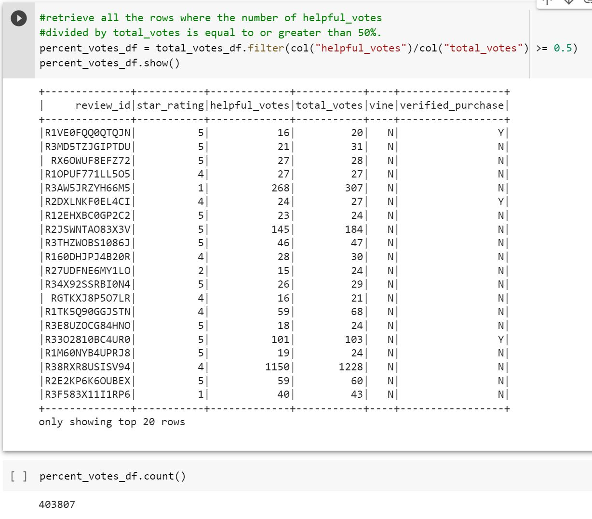
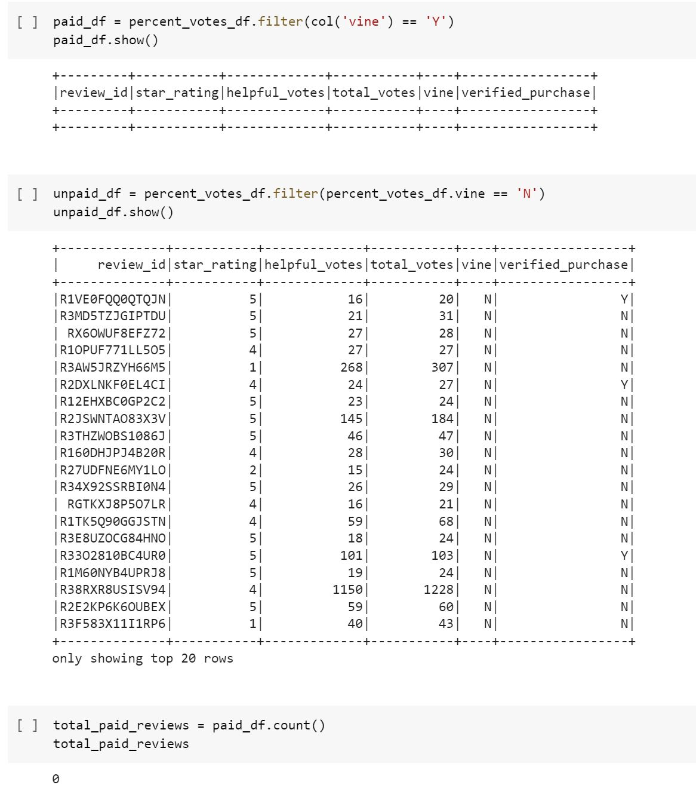
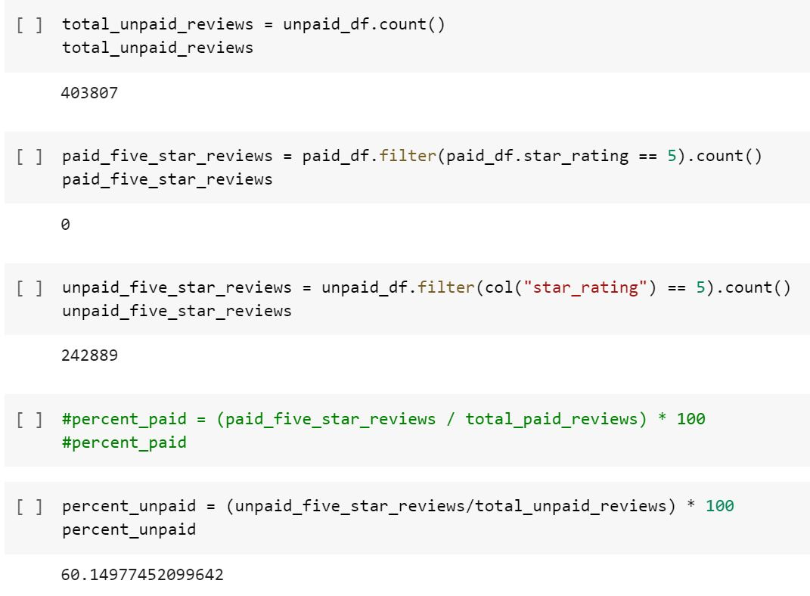

# Amazon_Vine_Analysis

## Overview
The purpose of this analysis was to use various natural language processings to 
perform the ETL process on Amazon book reviews, and to determine wheather there 
were any biases in reviews by Vine members. 

## Results

* There was 403,807 votes where the number of helpful_votes/total_votes was eaqual 
to or greater than 50%. 

* Unfortunately, when filtering the books dataset to retrieve all the rows of reviews
written as part of the paid vine program, there were no reviews. This made it impossible 
to gather the data for the total number of paid reviews, paid 5-star reviews, and the 
percent of paid 5-star reviews later in this portion of the challenge. 

* There was a total of 403,807 total_upaid_reviews, 242,889 unpaid_five_star_reviews,
and a return of 60% unpaid five star reviews. 

## Summary

If the data is correct and there were no paid vine reviews, then this analysis of the 
Amazon books reviews indicates that all the reviews were written by non-members of the
Amazon vine program. Because there was no data for the paid vine reviews, this made it
difficult to compare the paid vs unpaid vine reviews. Additionally, the percent of unpaid 
5-star reviews was 60% which is fairly high.